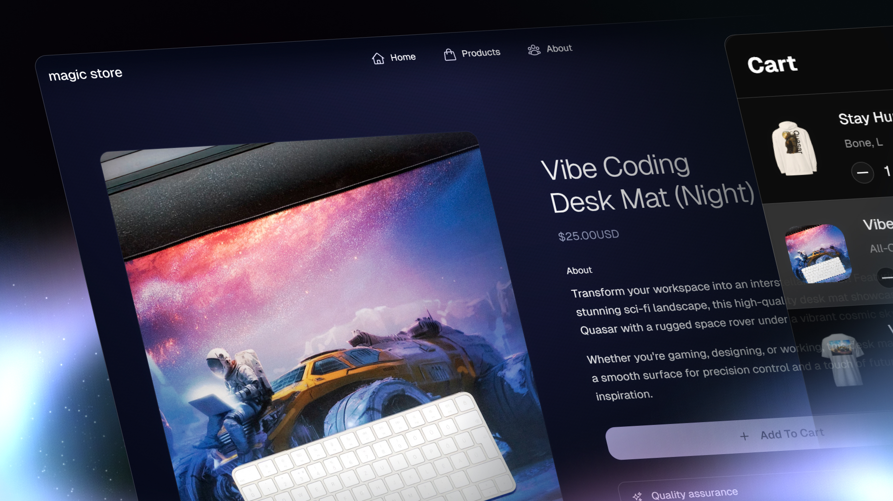

# Once UI x Fourthwall

Launch your premium storefront with Once UI and Fourthwall. Focus on branding and design, and let Fourthwall handle payment, shipping, and fulfillment.



[Live Demo](https://store.dopler.app)

[Docs](https://docs.once-ui.com/docs/magic-store/quick-start)

## Getting started

Get started with Magic Store in just a few steps:

1. [Set up a store](https://link.fourthwall.com/ref/design-engineers-club) on Fourthwall.

2. [Make some products](https://my-shop.fourthwall.com/admin/dashboard/products/all/) and [create a collection](https://my-shop.fourthwall.com/admin/dashboard/products/collections/).

3. After you have signed up, [get a storefront token](https://my-shop.fourthwall.com/admin/dashboard/settings/for-developers).

4. Fill out the environment variables below in .env.local.

```bash
NEXT_PUBLIC_FW_STOREFRONT_TOKEN="<your storefront token>" # Example: ptkn_...

NEXT_PUBLIC_FW_CHECKOUT="<your store url>" # Example: vercel-shop.fourthwall.com. Used for checkout
NEXT_PUBLIC_VERCEL_URL="<the url of your vercel site>" # Example: fw-commerce.vercel.app. This is used for sitemap.xml + robots.txt.
```

## Develop locally

You will need to use the environment variables [defined in `.env.example`](.env.example) to run Magic Store. Rename the file to `.env.local`.

> Note: You should not commit your `.env.local` file or it will expose secrets that will allow others to use your store.

```bash
npm install
npm run dev
```

Your app should now be running on [localhost:3000](http://localhost:3000/).

## Deploying

After you have completed the setup steps, you can deploy your store. Create the same environment variables on your hosting provider.

## Resources
* How to set up and customize your [Magic Store](https://docs.once-ui.com/docs/magic-store/quick-start)
* How to get your [collection handle](https://docs.fourthwall.com/storefront/collection).
* [Style your store](https://my-shop.fourthwall.com/admin/dashboard/store-design/layout/index/) for the [checkout flow](https://docs.fourthwall.com/storefront/checkout).